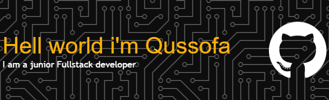

<!-- ## Hello world i'm qussofa 👋 -->

#### Hello world i'm qussofa 👋

##### 🌐 Socials:
  

##### 💻 Tech Stack:
          
#### 📊 GitHub Stats:
 
 

#### 🏆 GitHub Trophies

##### ✍️ Random Dev Quote

---

<h2 align="left">Play games with me</h2>

###

<picture>
  <source media="(prefers-color-scheme: dark)" srcset="https://raw.githubusercontent.com/qussofa/qussofa/output/pacman-contribution-graph-dark.svg">
  <source media="(prefers-color-scheme: light)" srcset="https://raw.githubusercontent.com/qussofa/qussofa/output/pacman-contribution-graph.svg">
  
</picture>

###

###

<!-- Proudly created with GPRM ( https://gprm.itsvg.in ) -->

<!--
**qussofa/qussofa** is a ✨ _special_ ✨ repository because its `README.md` (this file) appears on your GitHub profile.

Here are some ideas to get you started:

- 🔭 I’m currently working on ...
- 🌱 I’m currently learning ...
- 👯 I’m looking to collaborate on ...
- 🤔 I’m looking for help with ...
- 💬 Ask me about ...
- 📫 How to reach me: ...
- 😄 Pronouns: ...
- ⚡ Fun fact: ...
-->
<!-- 
- 🔭 I’m currently working on  [**Komiklab.xyz**](hhtps://komiklab.xyz)
 🌱 I’m currently learning Laravel Framework

 ##### Skills

 

 

 

 
 
 

 

##### Connect with Me

 

##### My Github Stats 

 -->

